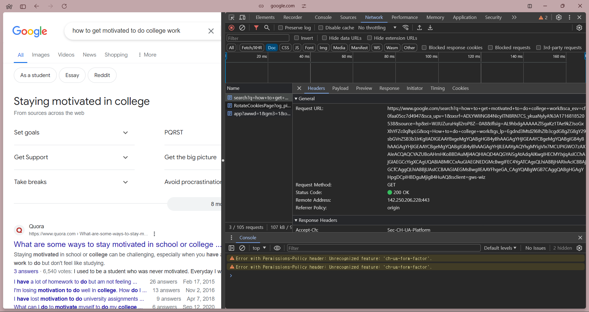
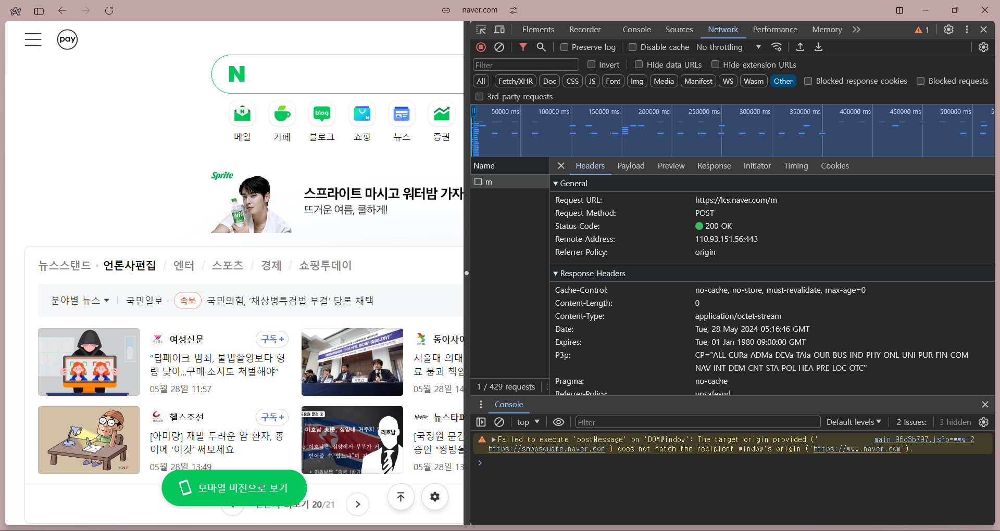
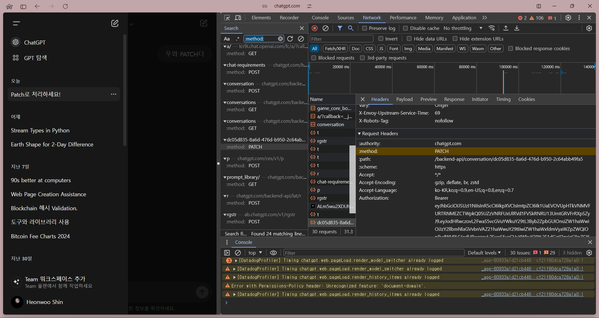

# Weekly I Learned - 3

## 과제 1

    HTTP 통신 메소드인 GET, POST, PUT, PATCH, DELETE를 직접 체험해보고 그 사용 사례를 정리하여 WIL3.md 파일에 정리한다.

### GET METHOD

- Google에서 검색할 때 GET 메서드를 사용한다.

### POST METHOD

- Naver에서 로그인할 때 POST 메서드가 사용된다.

### PUT METHOD

### PATCH METHOD

- ChatGPT에서 대화 내역을 삭제할 때 PATCH 메서드로 삭제한다.

### DELETE METHOD

## 과제 2

    HTTP/1.1, HTTP/2, HTTP/3의 차이점을 학습하고 그 역사를  WIL3.md 파일에 정리한다.

### HTTP/1.1

- HTTP/0.9, HTTP/1.0 이후 1997년 표준화된 HTTP 프로토콜
- POST, PUT, DELETE 등의 method가 생겨남
- TCP 프로토콜 위에서 작동
- 텍스트 기반의 요청과 응답
- Persistent Connections (`Connection: keep-alive` 헤더를 주고 받아 연결을 지속)
- 파이프라이닝 (요청에 대한 응답을 받기 전에도 다른 요청을 먼저 보냄)

### HTTP/2

- HTTP/1.1이 너무 느리다고 생각한 구글이 만든 SPDY 프로토콜을 기반으로 2015년에 표준화된 HTTP/2 등장
- Persistent Connections는 기본 (`Connection: keep-alive` 헤더를 주고 받지 않아도 됨)
- 바이너리 기반의 요청과 응답
- Multiplex Streaming (병렬 요청)
- 헤더가 압축됨

### HTTP/3

- 2022년 등장
- UDP 프로토콜 위에서 작동
- 그 위 QUIC 프로토콜을 사용함 (패킷 손실을 방지하는 TCP의 역할을 함)
